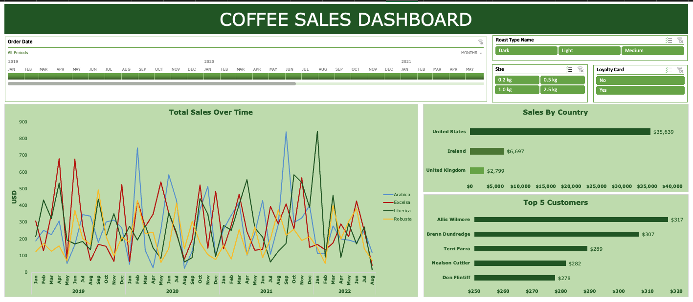

# ☕ Coffee Sales Dashboard (Excel)

This project is an **interactive Excel dashboard** designed to analyze and visualize coffee sales across multiple dimensions — customers, countries, product types, and time periods. It showcases my skills in **data cleaning**, **Excel formulas**, **pivot tables**, and **dashboard design**.



---
## 🎥 Dashboard Demo


---

## 📌 Project Overview

The goal of this project is to build a dynamic and interactive dashboard that provides stakeholders with quick insights into coffee sales performance. The dashboard allows users to filter by:

- **Roast Type**
- **Product Size**
- **Loyalty Card Status**
- **Date Range (via Timeline)**

It includes key visualizations such as:

- **Total Sales Over Time**
- **Sales by Country**
- **Top 5 Customers**

---

## 🛠️ Excel Techniques & Features Used

Here are the key Excel functions, formulas, and techniques applied:

#### 🔗 Data Preparation

1. **XLOOKUP**  
   - Used to retrieve customer details (Name, Email, Country) from the `Customers` sheet to the `Orders` sheet.
2. **INDEX + MATCH**  
   - Pulled product information (Coffee Type, Roast Type, Unit Price, and Size) from the `Products` sheet into the `Orders` sheet.
3. **Calculated Columns**  
   - Computed **Sales Amount** by multiplying `Unit Price` and `Quantity`.
4. **Nested IF Statements**  
   - Extracted and created readable **Coffee Type** and **Roast Type** labels from encoded data.
5. **Date Formatting**  
   - Standardized date entries using `dd-mmm-yyyy` format.

#### 📊 Data Cleaning & Transformation

6. Checked and removed **duplicate entries**.
7. Formatted **Unit Price** and **Sales Amount** as **Currency (USD)**.
8. Converted the full dataset into an **Excel Table** for dynamic range referencing.

#### 📈 Dashboard Construction

9. Created **Pivot Tables** and corresponding **Pivot Charts** to visualize:
   - Sales Trends
   - Country Sales Breakdown
   - Top Customers by Revenue
10. Added **Slicers** for interactivity across:
    - Roast Type
    - Product Size
    - Loyalty Card Status
11. Added a **Timeline Filter** to allow period-based analysis by month and year.
12. Updated Pivot Table source to include new data columns like `Loyalty Card`.
13. Assembled and formatted the dashboard for a clean layout and easy navigation.

---

## 🔍 Key Insights & Business Recommendations
#### 1. 💳 Loyalty Program Spending Behavior
**Insight:** Customers **without loyalty cards** tend to **spend more** than those with loyalty cards.

**Recommendation:** 
- Re-evaluate the loyalty program to ensure it incentivizes repeat purchases and higher spending.
- Consider offering tiered rewards or exclusive perks for higher spenders to boost engagement.

---

#### 2. 🇺🇸 Market Concentration in the U.S.
**Insight:** The **United States** dominates total sales, contributing the highest revenue.

**Recommendation:**
- Continue to invest in marketing and supply chain efficiency in the U.S. to maintain dominance.
- Explore similar customer profiles in other countries to expand and replicate the success.

---

#### 3. 🧊 Popular Product Size: 2.5kg
**Insight:** The **2.5kg** coffee size is the **most purchased** and generates the **highest revenue**.

**Recommendation:**
- Consider promotions or bundles around the 2.5kg size.
- Offer subscription options for regular bulk buyers.

---

#### 4. 📈 Seasonal Sales Trends
**Insight:** Sales fluctuate monthly, with recurring peaks.

**Recommendation:**
- Launch targeted campaigns and discount offers during these high-traffic periods.
- Stock inventory in advance and ramp up logistics to meet demand.

---

#### 5. ☕ Roast Preferences by Region
**Insight:** 
- Overall, customers prefer **Light Roast**, followed by **Medium**, then **Dark**.
<!-- - In contrast, **Ireland** shows a **strong preference for Dark Roast**.-->

**Recommendation:**
<!-- - Tailor marketing by region: promote **Dark Roast** more heavily in Ireland.
- Highlight **Light Roast** in U.S. campaigns and explore introducing new light variants. --> 
- Highlight **Light Roast** in campaigns and explore introducing new light variants.

---

## 📂 File Structure

```
📁 Coffee-Sales-Analysis/
├── data/
│   └── coffeeOrdersData.xlsx            # Excel file with original data
├── media/
│   ├── coffee-sales-dashboard.png       # Screenshot of the final dashboard
│   └── dashboard-demo.gif               # Animated demo of the interactive dashboard
├── coffee_sales_analysis.xlsx           # Excel workbook with dashboard and data
└── README.md                            # Project documentation
```

## 🎯 Skills Demonstrated

- Excel Functions: `XLOOKUP`, `INDEX`, `MATCH`, `IF`, Date & Text Formatting
- Data Cleaning & Validation
- Pivot Table & Pivot Chart Creation
- Dashboard Design & Visual Storytelling
- Use of Interactive Elements: Slicers & Timelines

## 👩🏽‍💻 Contact
Glory Odeyemi - Data Engineer & Analyst
- For questions, feedback, opportunities, or collaborations, connect with me via [LinkedIn](https://www.linkedin.com/in/glory-odeyemi/).
- For more exciting projects or inspiration, check out my [GitHub repositories](https://github.com/gloryodeyemi).
